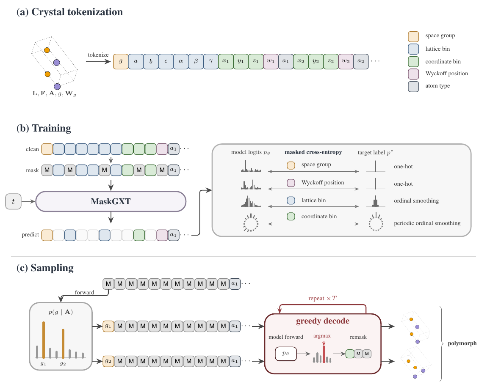
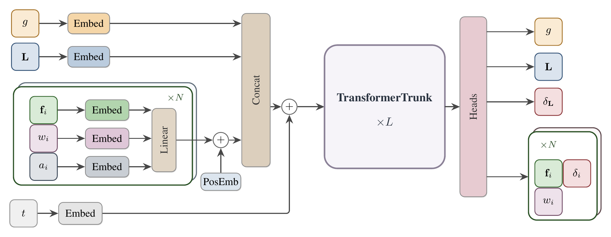

# MaskGXT

[](https://arxiv.org/abs/2606.22866)
[](https://sungsoo-ahn.github.io/blog/2026/maskgxt-ai-coscientist/)

Crystal structure prediction by masked generative modeling. Developed by an AI
co-scientist, [HACO](https://github.com/kiyoung98/HACO).

**Task.** Crystal structure prediction (CSP).

- **Input:** a chemical composition (the atoms in the unit cell).
- **Output:** the stable crystal structure — the lattice and the atomic positions.
- **Metrics:** a composition can have several stable structures (polymorphs), so
  we measure both
  - *single-structure accuracy* — one-to-one match rate / RMSE, and
  - *polymorph coverage* — METRe / cRMSE.

Explore crystal structures sampled by MaskGXT from the MP-20 polymorph split
test set at **[kiyoung98.github.io/MaskGXT](https://kiyoung98.github.io/MaskGXT/)**.



A crystal is tokenized into one sequence (space group, lattice bins, per-atom
coordinate bins / Wyckoff / element). The transformer is trained to fill masked
tokens, and samples by iteratively unmasking from an all-masked sequence.



## Setup

```bash
pip install -r requirements.txt
```

## Usage

Datasets: `mp_20`, `mp_20_ps` (MP-20 polymorph split), `mpts_52`.

```bash
# 1. data (streamed from OMatG -> data/<dataset>_*.pt)
python prepare.py --dataset mp_20

# 2. train (checkpoint -> runs/<run_name>/best.pt; use --batch_size 128 for mpts_52)
python train.py --dataset mp_20 --run_name mp20

# 3. sample one CIF per test entry (each command writes a separate samples dir)
python sample.py --dataset mp_20 --greedy --ckpt runs/mp20/best.pt                 # Table 1 (one-to-one)
python sample.py --dataset mp_20 --greedy --sg_stratify --ckpt runs/mp20/best.pt   # Table 2 (METRe)

# 4. score (each run prints all metrics; read the column matching the samples)
python evaluate.py --samples_dir runs/mp20/<decode tag>_samples --dataset mp_20
```

**Sampling flags** (independent):

- `--greedy` — MAP/argmax decoding (one CIF per test entry, index-aligned).
- `--sg_stratify` — assign distinct space groups across a composition's
  generations, for polymorph coverage.

The Wyckoff/SG tables under `precompute/` are committed; regenerate with
`precompute_normalizer.py` / `precompute_wyckoff.py`.

**`evaluate.py` metrics** (tolerances `ltol=0.3, stol=0.5, angle_tol=10°`):

- **METRe / cRMSE** — composition-pooled coverage (paper Table 2). Score the
  `--sg_stratify` samples.
- **One-to-one match rate / RMSE** — index-aligned, each test ref vs its single
  generation (paper Table 1). Score the `--greedy` samples. Reported twice:
  - *Unfiltered* — applied directly to the generations.
  - *Filtered* — a generation is unmatched if it fails CDVAE SMACT/structural
    validity. Needs `smact==2.6`; SMACT ≥ 4 changes oxidation tables and breaks
    reproduction.

## Citation

```bibtex
@misc{seong2026haco,
      title={Discovering Crystal Structure Prediction Algorithms with an AI Co-Scientist}, 
      author={Kiyoung Seong and Nayoung Kim and Sungsoo Ahn},
      year={2026},
      eprint={2606.22866},
      archivePrefix={arXiv},
      primaryClass={cs.LG},
      url={https://arxiv.org/abs/2606.22866}, 
}
```
